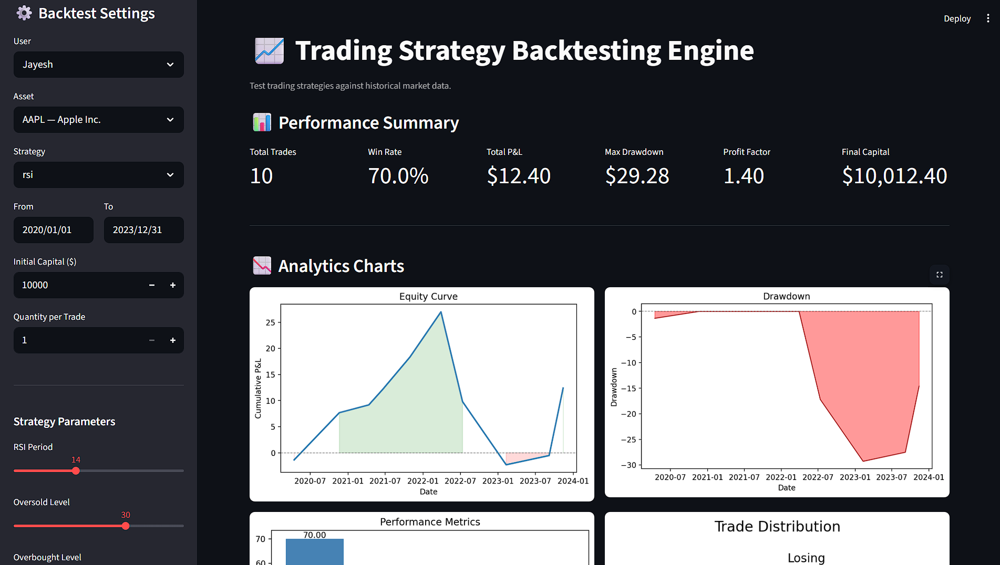

# SQL-Powered Trading Strategy Backtesting & Analytics Engine

A quantitative trading analytics platform that stores historical market data in MySQL, tests trading strategies against past market conditions, and generates detailed performance analytics and charts.

---




## What It Does

- Stores historical OHLCV (Open, High, Low, Close, Volume) market data in MySQL
- Imports CSV market datasets into the database automatically
- Runs trading strategies on historical data to generate buy/sell signals
- Tracks performance metrics: win rate, P&L, drawdown, profit factor, risk/reward
- Generates analytics dashboards and charts
- Compares multiple strategies on the same dataset

---

## Tech Stack

- Python, MySQL, Pandas, Matplotlib
- mysql-connector-python, python-dotenv

---

## Project Structure

```
project/
├── Analytics/
│   └── Charts.py                  # Equity curve, drawdown, comparison charts
├── Assets/
│   └── ER-Diagram.png             # Database schema diagram
├── Backtest/
│   └── BacktestEngine.py          # Main pipeline orchestrator
├── Import/
│   └── CSV_Import_Pipeline.py     # Loads CSV market data into DB
├── Metrics/
│   └── PerformanceMetrics.py      # Win rate, P&L, drawdown calculations
├── SQL/
│   ├── Schema.sql                 # All CREATE TABLE statements
│   └── Views.sql                  # Analytical views for querying results
├── Strategy/
│   ├── MovingAverageCrossOver.py  # MA Crossover strategy
│   ├── RSI.py                     # RSI strategy
│   └── Save_Trades.py             # Saves signals as trades to DB
├── download_data.py               # Downloads CSV from Yahoo Finance
├── setup.py                       # Imports CSV into the database
├── test_backtest.py               # Runs the full backtest pipeline
├── config.py                      # Loads DB credentials from .env
├── .env                           # Secret credentials — never commit this
├── .gitignore
├── requirements.txt
└── README.md
```

---

## Database Schema

| Table | Purpose |
|---|---|
| `users` | Platform users |
| `assets` | Stocks and crypto assets |
| `historical_prices` | OHLCV market data |
| `strategies` | Strategy definitions and parameters |
| `trades` | Individual buy/sell trade records |
| `backtest_results` | Backtest runs with capital info |
| `performance_metrics` | Aggregated metrics per backtest |

---

## First Time Setup

Follow these steps once before running any backtest.

### 1. Clone the repository

```bash
git clone https://github.com/your-username/backtesting-engine.git
cd backtesting-engine
```

### 2. Create and activate a virtual environment

```bash
python -m venv ENV
ENV\Scripts\activate        # Windows
source ENV/bin/activate     # macOS/Linux
```

### 3. Install dependencies

```bash
pip install -r requirements.txt
pip install yfinance
```

### 4. Create your `.env` file

Create a file named `.env` in the project root and add your MySQL credentials:

```
DB_HOST=localhost
DB_USER=root
DB_PASSWORD=your_password
DB_NAME=Backtesting_Engine
```

### 5. Set up the database

Open MySQL Workbench, open `SQL/Schema.sql` and run it, then open `SQL/Views.sql` and run it.

Or via terminal:

```bash
mysql -u root -p < SQL/Schema.sql
mysql -u root -p < SQL/Views.sql
```

### 6. Insert a test user

Open MySQL and run this once — required because trades are linked to a user:

```sql
USE Backtesting_Engine;
INSERT INTO users (username, email, password_hash)
VALUES ('testuser', 'test@email.com', 'hashedpassword123');
```

### 7. Download market data

Run `download_data.py` to fetch AAPL historical data from Yahoo Finance and save it as a CSV:

```bash
python download_data.py
```

### 8. Import the CSV into the database

Run `setup.py` to load the CSV into the `historical_prices` table:

```bash
python setup.py
```

---

## Running a Backtest

Once setup is done, run everything with a single command:

```bash
python test_backtest.py
```

This automatically loads price data from the database, runs the strategy, generates signals, saves trades, calculates all metrics, saves results to the database, and plots the analytics dashboard.

---

## Full Setup Order (Summary)

```
Step 1  →  Run Schema.sql in MySQL
Step 2  →  Run Views.sql in MySQL
Step 3  →  Insert test user in MySQL
Step 4  →  python download_data.py
Step 5  →  python setup.py
Step 6  →  python test_backtest.py   ← run this every time after
```

---

## Strategies

### Moving Average Crossover
Generates a BUY when the fast MA crosses above the slow MA, and a SELL when it crosses below.

Parameters: `fast_period` (default 10), `slow_period` (default 50)

### RSI Strategy
Generates a BUY when RSI crosses up through the oversold level, and a SELL when it crosses down through the overbought level.

Parameters: `period` (default 14), `oversold` (default 30), `overbought` (default 70)

---

## Performance Metrics

| Metric | Description |
|---|---|
| Win Rate | % of trades that were profitable |
| Total P&L | Sum of all profit and loss |
| Max Drawdown | Largest peak-to-trough loss |
| Profit Factor | Gross profit / gross loss |
| Risk/Reward | Average win size / average loss size |
| Total Trades | Number of completed trade pairs |

---

## Verify Results in MySQL

After running a backtest, check the results using the built-in views:

```sql
SELECT * FROM v_trade_summary;
SELECT * FROM v_backtest_overview;
SELECT * FROM v_strategy_performance ORDER BY win_rate_pct DESC;
SELECT * FROM v_asset_performance    ORDER BY total_pnl DESC;
SELECT * FROM v_monthly_pnl;
```

---

## Adding a New Strategy

1. Create a new file in `Strategy/`
2. Write a function that accepts a DataFrame and returns a list of signal dicts with `signal`, `price`, and `timestamp` keys
3. Register it in the `STRATEGIES` dictionary at the top of `Backtest/BacktestEngine.py`

The engine handles everything else automatically.

---

### Streamlit Integration
* For running they application on web we have integrated it with ```Streamlit```


## .gitignore

Make sure your `.gitignore` includes:

```
ENV/
.env
__pycache__/
*.pyc
```

---

## License

MIT License — free to use and modify.